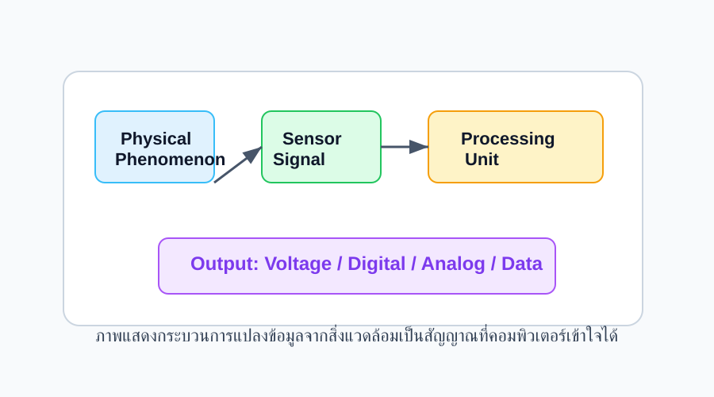
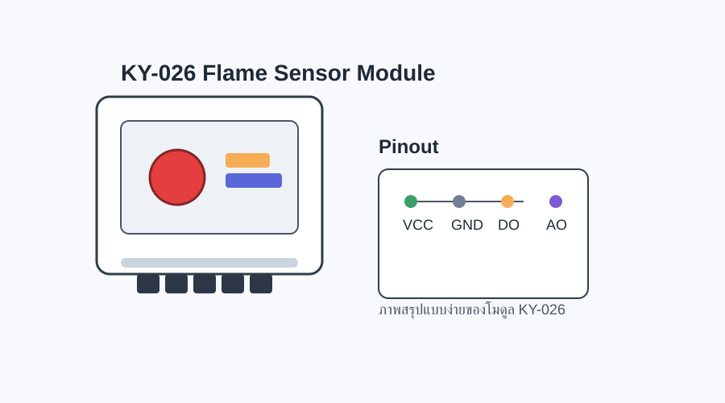

# KY-026 Flame Sensor Module

> ข้อมูลสรุปของโมดูลเซ็นเซอร์ตรวจจับเปลวไฟ KY-026 สำหรับใช้งานกับ Arduino, ESP32 และ PlatformIO

## 1. ความรู้เบื้องต้นเกี่ยวกับเซ็นเซอร์ (Sensor Fundamentals)
เซ็นเซอร์ (sensor) คืออุปกรณ์ที่ใช้รับข้อมูลจากสิ่งแวดล้อมและแปลงข้อมูลนั้นให้เป็นสัญญาณไฟฟ้าที่เครื่องอิเล็กทรอนิกส์สามารถประมวลผลได้ เซ็นเซอร์มักถูกใช้ในระบบอัตโนมัติและโครงงานอิเล็กทรอนิกส์เพื่อให้เครื่องจักรหรือไมโครคอนโทรลเลอร์สามารถรับรู้โลกรอบตัวได้

### หลักการทำงานของเซ็นเซอร์
โดยทั่วไปเซ็นเซอร์จะทำงานผ่าน 3 ขั้นตอนหลัก

1. ตรวจจับสภาวะหรือสิ่งแวดล้อม เช่น แสง อุณหภูมิ ความดัน ความชื้น หรือเสียง
2. แปลงข้อมูลเป็นสัญญาณไฟฟ้า เช่น แรงดัน กระแส หรือข้อมูลดิจิทัล
3. ส่งสัญญาณให้กับไมโครคอนโทรลเลอร์หรืออุปกรณ์ประมวลผลเพื่อวิเคราะห์ต่อ

### ประเภทของเอาต์พุตจากเซ็นเซอร์
- Analog Output: ส่งค่าที่เปลี่ยนแปลงต่อเนื่องตามค่าที่วัดได้
- Digital Output: ส่งค่าเป็น 0/1 หรือ High/Low เพื่อบอกสถานะ
- ข้อมูลเชิงสัญญาณพิเศษ เช่น I2C, SPI, UART สำหรับระบบที่ต้องการข้อมูลละเอียดมากขึ้น

### ลักษณะสำคัญของเซ็นเซอร์
- ความละเอียด (Resolution): ความสามารถในการแยกความแตกต่างของค่าที่วัดได้
- ความแม่นยำ (Accuracy): ความใกล้เคียงของค่าที่วัดกับค่าจริง
- ความไว (Sensitivity): อัตราการตอบสนองต่อการเปลี่ยนแปลงของสิ่งเร้า
- เวลาในการตอบสนอง (Response Time): เวลาที่เซ็นเซอร์ต้องใช้ในการตอบสนองต่อสัญญาณใหม่



## 2. ข้อมูลเซ็นเซอร์ KY-026 (Datasheet Overview)
โมดูล KY-026 เป็นเซ็นเซอร์ตรวจจับเปลวไฟที่ใช้หลักการรับแสงอินฟราเรดจากเปลวไฟ โดยภายในจะมีตัวรับแสงและตัวเปรียบเทียบสัญญาณ เพื่อให้ได้เอาต์พุตทั้งแบบดิจิทัลและแอนะล็อก โดยปกติจะใช้ในโครงงานตรวจจับไฟหรือตรวจหาความร้อนที่มีแสงอินฟราเรด



### หลักการทำงานของ KY-026
- ตัวรับแสงจะตรวจจับแสงอินฟราเรดที่ปล่อยจากเปลวไฟ
- สัญญาณที่รับได้จะถูกเปรียบเทียบโดย IC LM393
- เมื่อแสงที่ตรวจจับมีความเข้มเกินเกณฑ์ที่ตั้งไว้ จะส่งเอาต์พุตแบบดิจิทัลจากขา DO
- ขา AO จะให้ค่าความเข้มแสงในรูปแบบแอนะล็อกเพื่อให้ผู้ใช้อ่านและวิเคราะห์ต่อได้

### คุณสมบัติสำคัญของ KY-026
- แหล่งจ่ายไฟ: 3.3V ถึง 5V
- เอาต์พุต: Digital Output (DO) และ Analog Output (AO)
- ตัวเปรียบเทียบ: LM393
- ตัวรับแสง: YG1006 / IR receiver
- ปรับความไวได้ด้วย potentiometer
- มี LED แสดงสถานะการตรวจจับ

### ขาต่อและฟังก์ชัน
| Pin | ชื่อ | คำอธิบาย |
|---|---|---|
| 1 | VCC | จ่ายไฟ 3.3V - 5V |
| 2 | GND | ขาเชื่อมกราวด์ |
| 3 | DO | เอาต์พุตดิจิทัล (Low/High) |
| 4 | AO | เอาต์พุตแอนะล็อก (ค่าความเข้มแสง) |

### ข้อมูลทางเทคนิคทั่วไป
- แรงดันจ่ายไฟ: 3.3V ถึง 5V
- ชนิดเอาต์พุต: ดิจิทัลและแอนะล็อก
- มุมตรวจจับ: ประมาณ 60 องศา ขึ้นอยู่กับรุ่นและสภาพแวดล้อม
- ระยะตรวจจับ: ขึ้นอยู่กับขนาดของเปลวไฟและความเข้มของแสง โดยทั่วไปอาจอยู่ในช่วงไม่กี่สิบเซนติเมตรถึงประมาณ 1 เมตร
- ปรับความไว: ใช้ potentiometer ปรับค่าตามสภาพแวดล้อม
- ตัวรับแสง: ใช้ตัวรับแสงอินฟราเรดเพื่อรับคลื่นจากเปลวไฟ

## 3. การต่อวงจรกับ Arduino
| Arduino | KY-026 |
|---|---|
| 5V | VCC |
| GND | GND |
| D2 | DO |
| A0 | AO |

## 4. ตัวอย่างโค้ด Arduino
```cpp
int flamePin = 2;
int ledPin = 13;

void setup() {
  pinMode(flamePin, INPUT);
  pinMode(ledPin, OUTPUT);
  Serial.begin(9600);
}

void loop() {
  int flameState = digitalRead(flamePin);
  int analogValue = analogRead(A0);

  Serial.print("Digital: ");
  Serial.print(flameState);
  Serial.print(" | Analog: ");
  Serial.println(analogValue);

  if (flameState == LOW) {
    digitalWrite(ledPin, HIGH);
  } else {
    digitalWrite(ledPin, LOW);
  }

  delay(200);
}
```

## 5. ข้อสังเกตและคำแนะนำสำหรับการใช้งาน
- ควรทดสอบในสภาพแวดล้อมจริง เพราะแสงแดดหรือแสงจากแหล่งอื่นอาจส่งผลต่อการตรวจจับ
- หากต้องการความไวที่เหมาะสม ให้อ่านค่าจาก AO และปรับ potentiometer
- โมดูลนี้เหมาะสำหรับการทดลองและโครงงานตรวจจับเปลวไฟแบบง่าย
- ควรหลีกเลี่ยงการใช้งานในสถานที่ที่มีแสงสะท้อนจากวัตถุหรือแหล่งความร้อนอื่น ๆ มากเกินไป

## 6. สรุป
เซ็นเซอร์เป็นส่วนสำคัญของระบบอัตโนมัติและโครงงานอิเล็กทรอนิกส์ เพราะช่วยให้เครื่องมือรับรู้ข้อมูลจากสิ่งแวดล้อมได้ KY-026 เป็นตัวอย่างของเซ็นเซอร์ที่แปลงสัญญาณแสงเป็นข้อมูลที่สามารถประมวลผลโดยไมโครคอนโทรลเลอร์ได้อย่างง่ายดาย